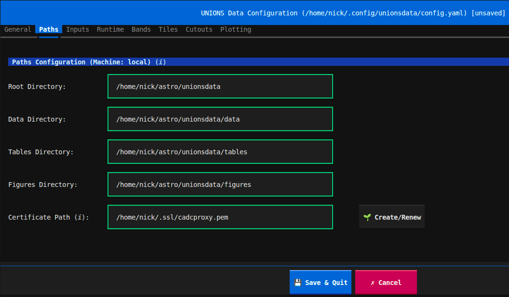

# UNIONSdata

[](https://pypi.org/project/unionsdata/)
[](https://github.com/heesters-nick/unionsdata/actions/workflows/ci.yml)
[](https://www.python.org/downloads/)
[](https://github.com/astral-sh/ruff)
[](http://mypy-lang.org/)

A Python package for downloading multi-band imaging data from the Ultraviolet Near Infrared Optical Northern Survey ([UNIONS](https://www.skysurvey.cc/)). The package downloads the reduced images from the CANFAR VOSpace vault using the [vos tool](https://pypi.org/project/vos/).

## Features

✨ **Multi-threaded downloads** - Parallel downloading for improved performance\
🎯 **Flexible input methods** - Use coordinates, tile numbers, or CSV catalogs\
🌳 **Spatial indexing** - KD-tree for efficient coordinate-to-tile matching\
📊 **Progress tracking** - Real-time download status and completion reports\
⚙️ **Configuration validation** - Pydantic-based config with clear error messages\
✂️ **Cutout creation** - Create and plot grayscale or RGB cutouts around objects of interest\
🛡️ **Graceful shutdown** - Clean interrupt handling with temp file cleanup

## Quick Start

```bash
# Install
pip install unionsdata

# Setup
unionsdata init    # Create your local copy of the config
unionsdata config  # Configure your download

# Download tiles
unionsdata download --tiles 217 292 --bands whigs-g cfis_lsb-r ps-i
```

## Prerequisites

1. **CANFAR VOSpace Account**\
    Register at https://www.canfar.net/en/

2. **UNIONS survey membership**\
    Until the first public data release only collaboration members have access to the data.

3. **Valid X.509 certificate for VOSpace access**\
    See below.

4. **System dependencies**\
    Installed automatically (see pyproject.toml)

## Installation & Setup

### Option 1: Install from PyPI (Recommended)

**Step 1:** Install the package

```bash
pip install unionsdata
```

**Step 2:** Initialize the configuration file

```bash
unionsdata init
```

This creates your configuration file at:
- **Linux/Mac**: `~/.config/unionsdata/config.yaml`
- **Windows**: `%APPDATA%/unionsdata/config.yaml`

**Step 3:** Edit the configuration

```bash
unionsdata config
```

This opens a terminal user interface (TUI). Set your paths, inputs and other parameters:



> 🔑 **Important:** Set up your CADC certificate in the TUI by clicking the Create/Renew button in the Paths tab and providing your CADC username and password. Credentials expire after 10 days. The button will indicate if a certificate is about to expire or already has. You can also manually create or renew your certificate in the terminal via:

```bash
cadc-get-cert -u YOUR_CANFAR_USERNAME
```


### Option 2: Install from Source (For Development)

**Step 1:** Clone and install

```bash
# Clone the repository
git clone https://github.com/heesters-nick/unionsdata.git

# Change into the cloned repository
cd unionsdata

# Install in editable development mode
pip install -e ".[dev]"
```

**Step 2:** Edit the configuration file directly at `src/unionsdata/config.yaml`

Update the paths:

```yaml
machine: local

paths_by_machine:
  local:
    root_dir_main: "/path/to/your/project"
    # **Important**: define location for downloaded data
    root_dir_data: "/path/to/download/data"
    dir_tables: "path/to/tables"
    dir_figures: "path/to/figures"
    cert_path: "/home/user/.ssl/cadcproxy.pem"
```

**Step 3:** Set up CANFAR credentials

```bash
cadc-get-cert -u YOUR_CANFAR_USERNAME
```

## Usage

### Command Line Interface

The package provides a `unionsdata` command with several subcommands:

| Command | Description |
|---------|-------------|
| `unionsdata init` | Initialize configuration file (first-time setup) |
| `unionsdata config` | Open terminal user interface to edit the config file |
| `unionsdata download` | Start downloading data |
| `unionsdata` | Shortcut alias for `unionsdata download` |
| `unionsdata plot` | Plot created cutouts |

>**📝 Important - First Run:** On your first download, the package automatically detects this and downloads tile availability information from CANFAR (~5 minutes one-time setup). A KD-tree spatial index is built for efficient coordinate-to-tile matching. Subsequent runs use the cached data.
>
> To refresh tile availability data later, use the `--update-tiles` flag:
> ```bash
> unionsdata download --update-tiles
> ```
>
> Or tick the `Update Tiles` option in the TUI.

#### Download Specific Tiles

Download tiles by their tile numbers (x, y pairs):

```bash
unionsdata download --tiles 217 292 234 295
```

Download specific bands only:

```bash
unionsdata download --tiles 217 292 --bands whigs-g cfis_lsb-r ps-i
```

#### Download by Coordinates

Download tiles containing specific RA/Dec coordinates (in degrees):

```bash
unionsdata download --coordinates 227.3042 52.5285 231.4445 52.4447
```

#### Download from CSV Catalog

Download tiles for objects in a CSV file:

```bash
unionsdata download --table /path/to/catalog.csv
```

Your CSV should have columns for RA, Dec, and object ID. Example:

```csv
ID,ra,dec
M101,210.8022,54.3489
2,231.4445,52.4447
```

> **Note:** Column names are customizable in the configuration file.

#### Download All Available Tiles

> **⚠️ Warning:** This will download a large amount of data!

```bash
unionsdata download --all-tiles --bands whigs-g cfis_lsb-r
```

### Using the Terminal User Interface (TUI)

Instead of using command-line arguments, you can configure downloads in the terminal user interface via

```bash
unionsdata config
```

A clickable user interface will open in your terminal where you can specify options for your download, cutout creation and subsequent cutout plotting. The configuration is grouped into several tabs: General, Paths, Inputs, Runtime, Bands, Tiles, Cutouts, and Plotting. The input fields are validated in real time: all drop down menus need to have a selection before allowing you to save the config file. Text boxes have a green border if the entry is valid and a red one if it is invalid. The info icons **(𝑖)** next to the settings in the TUI provide additional information. Choose either specific sky coordinates or a table of objects as an input and enable cutout creation if you want to plot your input objects after the data is downloaded. The application will augment your input table (or create a table from your input coordinates) and save it to the `Tables` directory. In the `Plotting` tab you can specify the catalog from which objects should be plotted under `Catalog Name`. The setting `Auto` automatically uses the most recent input. Once you have completed the configuration, hit the `Save & Quit` button.

Then run:

```bash
unionsdata download
```

Or simply:

```bash
unionsdata
```

If you have opted to create cutouts, you can plot them using:

```bash
unionsdata plot
```

## Supported Bands

| Band | Survey | Filter |
|------|--------|--------|
| `cfis-u` | CFIS | u-band |
| `whigs-g` | WHIGS | g-band |
| `cfis-r` | CFIS | r-band |
| `cfis_lsb-r` | CFIS | r-band (LSB optimized) |
| `ps-i` | Pan-STARRS | i-band |
| `wishes-z` | WISHES | z-band |
| `ps-z` | Pan-STARRS | z-band |

## Output Structure

Downloaded files are organized by tile and band:

```
data/
├── 217_292/
│   ├── whigs-g/
│   │   └── calexp-CFIS_217_292.fits
│   ├── cfis_lsb-r/
│   │   └── CFIS_LSB.217.292.r.fits
│   ├── ps-i/
│   │   └── PSS.DR4.217.292.i.fits
│   └── cutouts/
│       └── 217_292_cutouts_512.h5
└── 234_295/
    └── ...
```

## Configuration Reference

### Key Configuration Options

| Section | Option | Description |
|---------|--------|-------------|
| `Inputs` | `Input Source` | Input method: `Specific Tiles`, `Sky Coordinates`, `Table (CSV)`, or `All Available Tiles` |
| `Runtime` | `Download Threads` | Number of parallel download threads (1-32) |
| `Runtime` | `Cutout Processes` | Number of parallel cutout processes (1-32) |
| `Bands` | `Band Selection` | List of bands to download |
| `Tiles` | `Update Tiles` | Refresh tile lists from VOSpace |
| `Tiles` | `Band Constraint` | Minimum bands required per tile |
| `Tiles` | `Require All Bands` | Require that all requested bands are available to download a tile |
| `Cutouts` | `Cutout Mode` | Create cutouts around input coordinates: `After Download` or `Direct Only`. Works if input is `Sky Coordinates` or `Table` |
| `Plotting` | `Catalog Name` | Name of the catalog that should be used to plot cutouts around objects. `Auto` will use the most recent input |
| `Plotting` | `RGB Bands` | Select which bands should be mapped to red, green and blue to create color images. Locked in after selection. Hit the `Reset` button to start over. |
| `Plotting` | `Display Mode` | `Grid`: plot object cutouts in a grid; `Channel`: show individual bands + RGB image for every object |

### Band Configuration

Each band has a specific file structure and location. Example for the WHIGS g-band:

```yaml
bands:
  whigs-g:
    name: "calexp-CFIS"
    band: "g"
    vos: "vos:cfis/whigs/stack_images_CFIS_scheme"
    suffix: ".fits"
    delimiter: "_"
    fits_ext: 1  # Data extension in fits file
    zfill: 0  # No zero padding the tile numbers in the file name
    zp: 27.0  # Zero point magnitude
```

> **Note:** Data paths or file formats may change over time. Check the [CANFAR vault](https://www.canfar.net/storage/vault/list/cfis) for current locations:

| Band | vault directory |
|------|--------|
| `cfis-u` | tiles_DR6 |
| `whigs-g` | whigs |
| `cfis-r` | tiles_DR6 |
| `cfis_lsb-r` | tiles_LSB_DR6 |
| `ps-i` | panstarrs |
| `wishes-z` | wishes_1 |
| `ps-z` | panstarrs |

## Troubleshooting

### Certificate Expired

```bash
cadc-get-cert -u YOUR_CANFAR_USERNAME
```

### Config Issues

```bash
# Create a fresh copy of the default config file in your local environment
unionsdata init --force
```

## Acknowledgments

- UNIONS collaboration
- CANFAR (Canadian Advanced Network for Astronomical Research)

## Links

- [**UNIONS Survey**](http://www.skysurvey.cc/)
- [**CANFAR**](https://www.canfar.net/)
- [**CANFAR Storage Documentation**](https://www.opencadc.org/canfar/latest/platform/storage/)
- [**CANFAR VOSpace Documentation**](https://www.opencadc.org/canfar/latest/platform/storage/vospace/)
- [**vostools**](https://github.com/opencadc/vostools)

## Support

For issues and questions:
- Open an issue on [GitHub](https://github.com/heesters-nick/unionsdata)
- Contact: nick.heesters@epfl.ch

---
